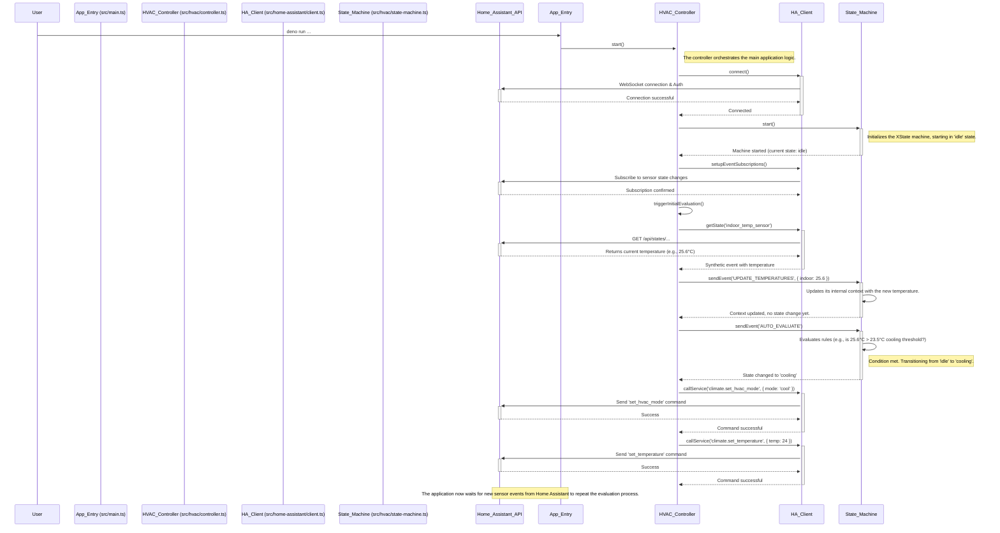

```mermaid
sequenceDiagram
    participant User
    participant App_Entry (src/main.ts)
    participant HVAC_Controller (src/hvac/controller.ts)
    participant HA_Client (src/home-assistant/client.ts)
    participant State_Machine (src/hvac/state-machine.ts)
    participant Home_Assistant_API

    User->>App_Entry: deno run ...
    App_Entry->>+HVAC_Controller: start()
    note right of HVAC_Controller: The controller orchestrates the main application logic.

    HVAC_Controller->>+HA_Client: connect()
    HA_Client->>+Home_Assistant_API: WebSocket connection & Auth
    Home_Assistant_API-->>-HA_Client: Connection successful
    HA_Client-->>-HVAC_Controller: Connected

    HVAC_Controller->>+State_Machine: start()
    note right of State_Machine: Initializes the XState machine, starting in 'idle' state.
    State_Machine-->>-HVAC_Controller: Machine started (current state: idle)

    HVAC_Controller->>+HA_Client: setupEventSubscriptions()
    HA_Client->>+Home_Assistant_API: Subscribe to sensor state changes
    Home_Assistant_API-->>-HA_Client: Subscription confirmed

    HVAC_Controller->>HVAC_Controller: triggerInitialEvaluation()
    HVAC_Controller->>+HA_Client: getState('indoor_temp_sensor')
    HA_Client->>+Home_Assistant_API: GET /api/states/...
    Home_Assistant_API-->>-HA_Client: Returns current temperature (e.g., 25.6°C)
    HA_Client-->>-HVAC_Controller: Synthetic event with temperature

    HVAC_Controller->>+State_Machine: sendEvent('UPDATE_TEMPERATURES', { indoor: 25.6 })
    State_Machine->>State_Machine: Updates its internal context with the new temperature.
    State_Machine-->>-HVAC_Controller: Context updated, no state change yet.

    HVAC_Controller->>+State_Machine: sendEvent('AUTO_EVALUATE')
    State_Machine->>State_Machine: Evaluates rules (e.g., is 25.6°C > 23.5°C cooling threshold?)
    note right of State_Machine: Condition met. Transitioning from 'idle' to 'cooling'.
    State_Machine-->>-HVAC_Controller: State changed to 'cooling'

    HVAC_Controller->>+HA_Client: callService('climate.set_hvac_mode', { mode: 'cool' })
    HA_Client->>+Home_Assistant_API: Send 'set_hvac_mode' command
    Home_Assistant_API-->>-HA_Client: Success
    HA_Client-->>-HVAC_Controller: Command successful

    HVAC_Controller->>+HA_Client: callService('climate.set_temperature', { temp: 24 })
    HA_Client->>+Home_Assistant_API: Send 'set_temperature' command
    Home_Assistant_API-->>-HA_Client: Success
    HA_Client-->>-HVAC_Controller: Command successful

    note over App_Entry, Home_Assistant_API: The application now waits for new sensor events from Home Assistant to repeat the evaluation process.
```
